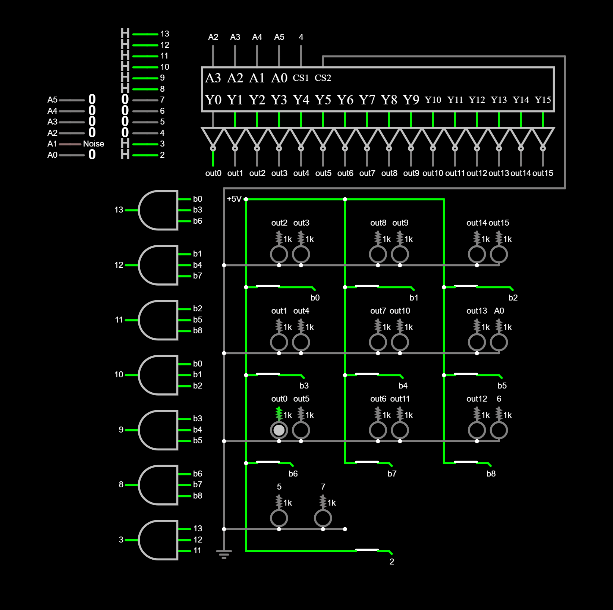

# Tic-Tac-Toe

## **Overview**
This project is a hardware-driven implementation of Tic-Tac-Toe, focusing on integrating electronic design principles with classic game logic. The aim is to create a fully interactive and physically embedded Tic-Tac-Toe system using circuitry, timers, and logic components. The project blends creativity, hardware engineering, and gameplay in a seamless and responsive interface.

## **Features**
1. **Real-Time Gameplay**:
   - A 3x3 grid system tracked using hardware-based logic.
   - Both user and computer moves are visually represented.

2. **Timing Mechanism**:
   - Tracks the time for each move and total game time using custom timers.

4. **Custom Circuit Design**:
   - Implements logic gates, decoders, and timers for move handling and victory detection.
   - Hardware-first approach, differentiating from software-only implementations.

## **Hardware Components**
1. **Microcontroller**: Arduino Uno R3 for handling game logic.
2. **Buttons and Pins**:
   - **Interrupt Pins**: Capture user input.
   - **Row/Column Pins**: Detect moves and update grid states.
   - Analog pin A1 generates random seed values for computer moves.
   - Analog pins A0 - A5 and pin 6 serve as outputs for the LEDs.
3. **LEDs**: Provide visual feedback for moves and grid states.
4. **Timers**: Built-in timer (Timer1) for tracking gameplay duration and delays.

## **Circuit Schematic**

## **Software Components**
1. **Grid State Logic**:
   - A 3x3 matrix to track user and computer moves.
2. **Move Prediction**:
   - Function to randomize computer moves while ensuring they are valid.
3. **Victory Detection**:
   - Logic to check for winning combinations in rows, columns, and diagonals.
4. **Timers and Delays**:
   - Timer1 configured in **CTC mode** to generate periodic interrupts for move timing.

## **Setup**
1. **Connect Hardware**: Follow the schematic
   - Connect buttons for user input on row and column pins.
   - Configure LEDs or other visual indicators for grid state.
   - Set up an analog input pin for generating randomness.
2. **Microcontroller Configuration and testing**:
   - Upload the code from the 'game_final' folder to the microcontroller.
   - To test the buttons and lights, you can upload the files from the 'buttonTest' and 'lightTest' folders.
   - Use the Serial Monitor for debugging and observing gameplay.
3. **Game Mechanics**:
   - Press buttons to make moves on the 3x3 grid.
   - Watch the computer respond with randomized moves.
   - Observe real-time feedback on the grid and victory detection.

## **How It Works**
### **Game Flow**
1. **User Input**:
   - The user selects a row and column via buttons.
   - The system validates the move and updates the grid.
   
2. **Computer Response**:
   - Random seed is generated using analog input.
   - Computer selects an empty cell and updates the grid.

3. **Victory Check**:
   - After each move, the system checks for win conditions (rows, columns, diagonals).
   - If no moves remain, the game declares a draw.

4. **Timing**:
   - Total game time and move durations are calculated using Timer1.
   - Timer1 is set to operate in **CTC mode** with a prescaler of 256.
   - These values are displayed on the Serial Monitor.

### **Victory Conditions**
The system checks for:
- Three consecutive marks in any row, column, or diagonal.
- If no moves remain, it declares a draw.
